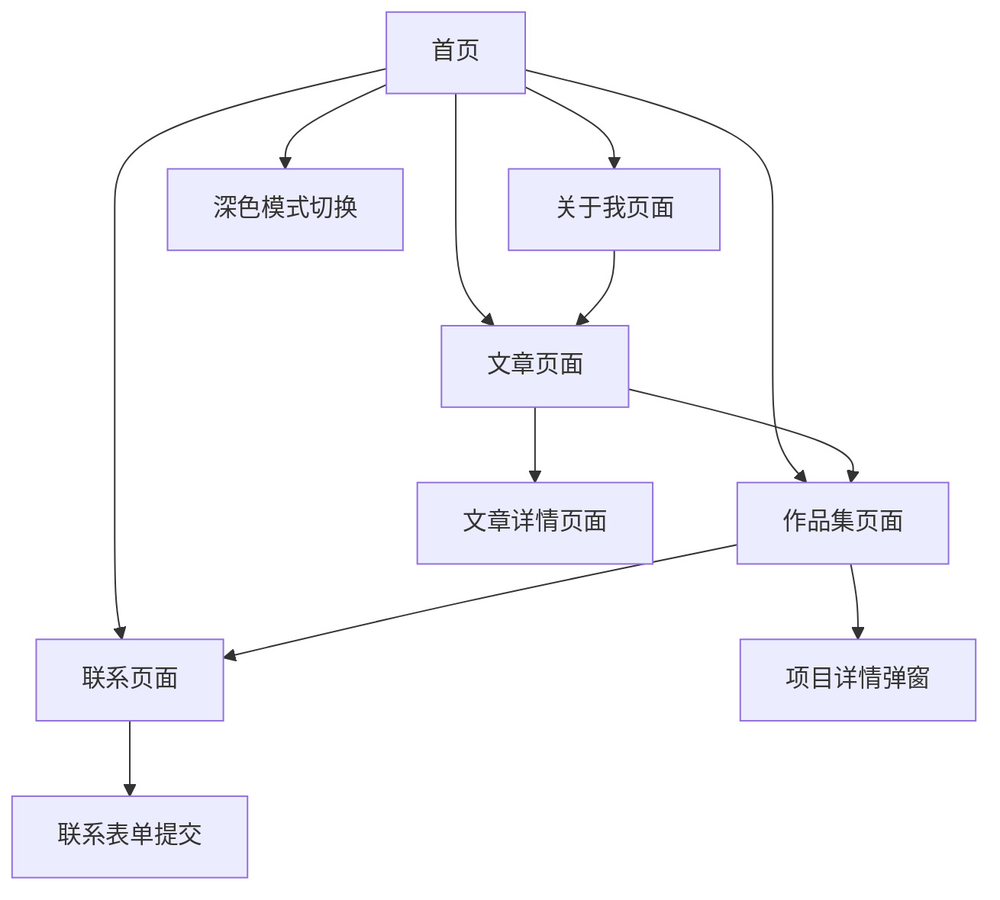

# Vue3个人主页产品需求文档

## 1. 产品概述
一个现代化的个人主页网站，用于展示个人信息、技能、项目作品和联系方式。
- 主要目的：为个人提供专业的在线展示平台，帮助建立个人品牌形象，方便潜在雇主或合作伙伴了解个人能力和作品。
- 目标用户：求职者、自由职业者、创作者等需要展示个人能力的用户。

## 2. 核心功能

### 2.1 用户角色
本项目为静态个人展示网站，无需用户注册登录功能。

### 2.2 功能模块
我们的个人主页包含以下主要页面：
1. **首页**：英雄区域、导航菜单、个人简介预览、十年之约展示
2. **关于我页面**：详细个人介绍、教育背景、工作经历
3. **文章页面**：博客文章列表、文章详情、RSS订阅
4. **作品集页面**：项目展示、项目详情、技术栈说明
5. **联系页面**：联系方式、社交媒体链接、联系表单

### 2.3 页面详情

| 页面名称 | 模块名称 | 功能描述 |
|----------|----------|----------|
| 首页 | 英雄区域 | 展示个人头像、姓名、职业标题和简短介绍，包含动态效果 |
| 首页 | 导航菜单 | 提供页面间跳转，支持平滑滚动到对应区域 |
| 首页 | 个人简介预览 | 简要介绍个人背景和专业领域 |
| 关于我页面 | 个人详情 | 展示详细的个人介绍、教育背景、工作经历时间线 |
| 关于我页面 | 个人照片 | 展示个人形象照片或头像 |
| 文章页面 | 文章列表 | 展示从RSS获取的博客文章，支持分页和搜索 |
| 文章页面 | 文章详情 | 显示文章完整内容、发布时间、标签等信息 |
| 首页 | 十年之约 | 展示加入十年之约的天数统计，开始日期2024年9月6日 |
| 作品集页面 | 项目卡片 | 展示项目缩略图、标题、简介和技术栈 |
| 作品集页面 | 项目详情 | 点击查看项目详细信息、演示链接、源码链接 |
| 联系页面 | 联系信息 | 展示邮箱、电话、地址等联系方式 |
| 联系页面 | 社交链接 | 提供GitHub、LinkedIn等社交媒体链接 |
| 联系页面 | 联系表单 | 访客可填写姓名、邮箱、消息内容并发送 |

## 3. 核心流程

**访客浏览流程：**
访客进入首页 → 浏览个人简介和十年之约 → 查看详细介绍（关于我） → 阅读博客文章 → 查看项目作品 → 获取联系方式

## 4. 用户界面设计

### 4.1 设计风格
- **主色调**：深蓝色 (#2563eb) 和白色 (#ffffff)
- **辅助色**：浅灰色 (#f8fafc)、深灰色 (#64748b)
- **深色模式**：深色背景 (#1f2937)、浅色文字 (#f9fafb)，支持一键切换
- **按钮样式**：圆角按钮，悬停时有渐变效果
- **字体**：主标题使用 Inter 字体，正文使用系统默认字体
- **布局风格**：卡片式布局，顶部导航栏固定
- **图标风格**：使用简洁的线性图标，支持动画效果
- **十年之约样式**：特殊的计数器样式，突出显示天数

### 4.2 页面设计概览

| 页面名称 | 模块名称 | UI元素 |
|----------|----------|--------|
| 首页 | 英雄区域 | 全屏背景渐变，居中对齐的个人信息，动态打字效果 |
| 首页 | 导航菜单 | 固定顶部导航，半透明背景，平滑滚动效果 |
| 关于我页面 | 个人详情 | 左右分栏布局，左侧照片右侧文字，时间线样式 |
| 文章页面 | 文章列表 | 卡片式文章布局，支持标签筛选和搜索功能 |
| 文章页面 | 文章详情 | 清晰的排版，代码高亮，深色模式适配 |
| 首页 | 十年之约 | 醒目的计数器显示，包含开始日期和已坚持天数 |
| 全局 | 深色模式 | 顶部导航栏的切换按钮，平滑的主题过渡动画 |
| 作品集页面 | 项目展示 | 瀑布流或网格布局，悬停时卡片阴影效果 |
| 联系页面 | 联系表单 | 简洁的表单设计，输入框聚焦效果，提交按钮动画 |

### 4.3 响应式设计
采用移动优先的响应式设计，支持桌面端、平板端和移动端适配，包含触摸交互优化。