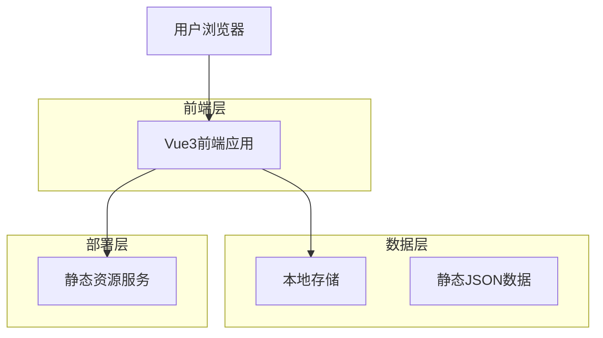
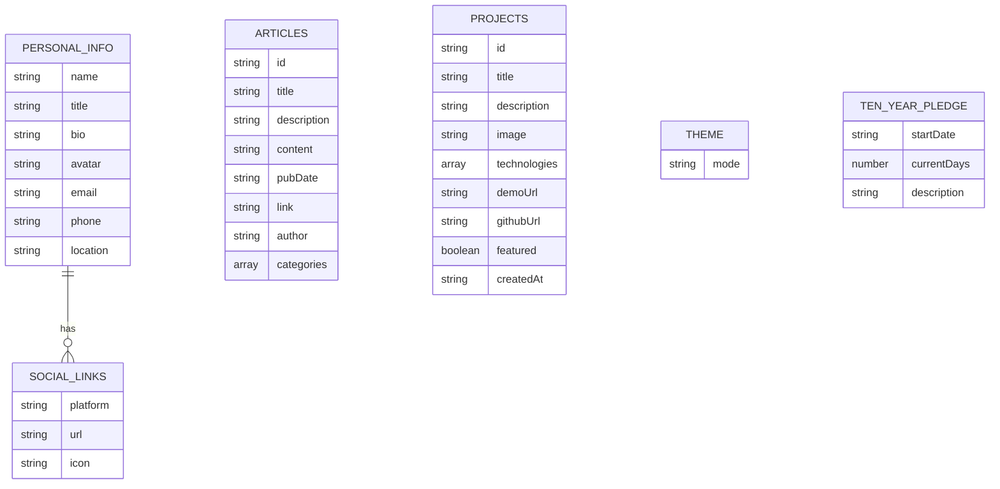

# Vue3个人主页技术架构文档

## 1. 架构设计



## 2. 技术描述

* **前端**：Vue3 + TypeScript + Vite + TailwindCSS

* **状态管理**：Pinia

* **路由**：Vue Router 4

* **UI组件**：自定义组件 + Headless UI

* **图标**：Heroicons

* **动画**：CSS3 + Vue Transition

* **RSS解析**：原生fetch + XML解析

* **深色模式**：TailwindCSS dark mode + localStorage

* **构建工具**：Vite

* **代码规范**：ESLint + Prettier

* **部署**：静态网站托管（Vercel/Netlify）

## 3. 路由定义

| 路由         | 用途              |
| ---------- | --------------- |
| /          | 首页，展示英雄区域和导航    |
| /about     | 关于我页面，展示个人详细信息  |
| /articles  | 文章页面，展示博客文章列表和详情 |
| /portfolio | 作品集页面，展示项目作品    |
| /contact   | 联系页面，展示联系方式和表单  |

## 4. 组件架构

### 4.1 核心组件结构

```
src/
├── components/
│   ├── layout/
│   │   ├── Header.vue          # 顶部导航组件
│   │   ├── Footer.vue          # 底部组件
│   │   └── Layout.vue          # 布局容器
│   ├── ui/
│   │   ├── Button.vue          # 按钮组件
│   │   ├── Card.vue            # 卡片组件
│   │   ├── Modal.vue           # 模态框组件
│   │   └── ProgressBar.vue     # 进度条组件
│   └── sections/
       ├── HeroSection.vue     # 英雄区域
       ├── AboutSection.vue    # 关于我区域
       ├── ArticlesSection.vue # 文章展示区域
       ├── TenYearSection.vue  # 十年之约区域
       ├── PortfolioSection.vue # 作品集区域
       └── ContactSection.vue  # 联系区域
├── views/
│   ├── HomeView.vue            # 首页视图
│   ├── AboutView.vue           # 关于页视图
│   ├── ArticlesView.vue        # 文章页视图
│   ├── ArticleDetailView.vue   # 文章详情页视图
│   ├── PortfolioView.vue       # 作品集页视图
│   └── ContactView.vue         # 联系页视图
├── stores/
│   ├── user.ts                 # 用户信息状态
│   ├── portfolio.ts            # 作品集状态
│   ├── articles.ts             # 文章状态
│   ├── theme.ts                # 主题状态（深色模式）
│   └── contact.ts              # 联系表单状态
├── services/
│   └── rss.ts                  # RSS解析服务
└── data/
    ├── personal.json           # 个人信息数据
    └── projects.json           # 项目数据
```

### 4.2 TypeScript类型定义

```typescript
// 个人信息类型
interface PersonalInfo {
  name: string;
  title: string;
  bio: string;
  avatar: string;
  email: string;
  phone?: string;
  location: string;
  socialLinks: SocialLink[];
}

// 社交链接类型
interface SocialLink {
  platform: string;
  url: string;
  icon: string;
}

// 文章类型
interface Article {
  id: string;
  title: string;
  description: string;
  content: string;
  pubDate: string;
  link: string;
  author?: string;
  categories: string[];
}

// 主题类型
interface Theme {
  mode: 'light' | 'dark';
}

// 十年之约类型
interface TenYearPledge {
  startDate: string; // '2024-09-06'
  currentDays: number;
  description: string;
}

// 项目类型
interface Project {
  id: string;
  title: string;
  description: string;
  image: string;
  technologies: string[];
  demoUrl?: string;
  githubUrl?: string;
  featured: boolean;
  createdAt: string;
}

// 联系表单类型
interface ContactForm {
  name: string;
  email: string;
  subject: string;
  message: string;
}

// RSS响应类型
interface RSSResponse {
  title: string;
  description: string;
  link: string;
  items: Article[];
}
```

## 5. 数据模型

### 5.1 数据模型定义



### 5.2 静态数据文件结构

**个人信息数据 (personal.json)**

```json
{
  "name": "张三",
  "title": "前端开发工程师",
  "bio": "热爱技术，专注于现代前端开发...",
  "avatar": "/images/avatar.jpg",
  "email": "zhangsan@example.com",
  "phone": "+86 138 0000 0000",
  "location": "北京，中国",
  "socialLinks": [
    {
      "platform": "GitHub",
      "url": "https://github.com/username",
      "icon": "github"
    }
  ]
}
```

**十年之约数据 (tenYear.json)**

```json
{
  "startDate": "2024-09-06",
  "description": "加入十年之约，坚持写博客",
  "currentDays": 0
}
```

**主题配置 (theme.json)**

```json
{
  "mode": "light"
}
```

**项目数据 (projects.json)**

```json
[
  {
    "id": "project-1",
    "title": "个人博客系统",
    "description": "基于Vue3开发的个人博客...",
    "image": "/images/projects/blog.jpg",
    "technologies": ["Vue3", "TypeScript", "Vite"],
    "demoUrl": "https://demo.example.com",
    "githubUrl": "https://github.com/username/blog",
    "featured": true,
    "createdAt": "2024-01-01"
  }
]
```

